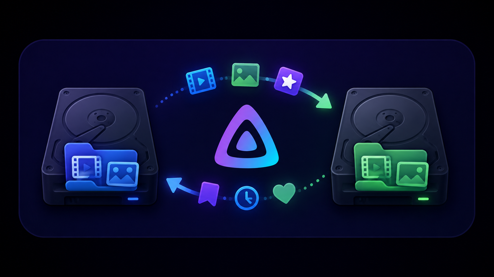

<p align="center">
  
</p>

# Restore User Data After Move

**Moved your media and Jellyfin forgot everything you'd watched?** This recovers
it.

When a file's path changes, Jellyfin treats it as a different item — it derives
an item's ID by hashing its path — so the old item is deleted and a new one takes
its place. Your played flags, resume positions, favorites and ratings belong to
the old item and are left behind.

They are not deleted. Jellyfin keeps those rows, blanks the link to the item that
owned them, and stamps a retention date. The cleanup task that would eventually
purge them has no default schedule, so on a stock server they sit there
indefinitely — unreachable rather than gone.

This plugin finds those stranded rows, works out which item each one belongs to
now, and puts the state back — through Jellyfin's own user-data manager, never by
editing the database.

## What it recovers

Per user, for movies and episodes: played status, play count, resume position,
favorite, last-played date, and rating.

A stranded snapshot is only matched when a current item reports the exact same key
*and* the match carries real identity evidence — the item's own GUID, an IMDb ID,
or two provider keys corroborating each other. A bare number is not enough on its
own: Jellyfin stores TMDb IDs with no provider namespace, so a number that is
unique among your current items could still have belonged to something you deleted
years ago.

## What it does not do

- **It does not prevent future loss.** It cleans up after a move, it does not
  stop one from stranding data in the first place.
- **It cannot see user data parked on a dead item.** When a folder drains
  completely, Jellyfin defers removing the items that lived there — they stay in
  the library holding their user data even though the files are gone. Those rows
  are not detached yet, so this plugin cannot consider them. They become
  recoverable on their own once something lands in that folder and the next scan
  removes the items. Run [`scripts/parked-userdata.sh`](scripts/parked-userdata.sh)
  to see whether you have any; it is read-only and safe to run while Jellyfin is
  up.
- **It does not reconstruct your watch history.** Jellyfin keeps only the most
  recent stranded snapshot per title, not every state it ever had.
- **It does not guess.** A stranded row is only restored when it maps to exactly
  one current item with sufficient identity evidence. Anything ambiguous is
  reported and skipped, by design — a plausible wrong match is worse than an
  honest "couldn't tell."
- **It does not overwrite.** If the current item already has user state, it is
  left alone.
- **It does not touch the stranded rows themselves**, and it never writes to the
  database directly. Everything goes through Jellyfin's own user-data manager.

## How it works

One scheduled task, **Restore user data after move**. It finds the stranded rows,
works out which item each belongs to now, and restores them in the same pass. It
leaves a plan file behind recording exactly what it did and giving a reason for
everything it skipped.

**It ships with no schedule, so it will not run until you give it one.** That is
deliberate. This task is only useful once your mover has finished and the library
has been rescanned, and Jellyfin cannot express "run after that" — it has no task
chaining, only clock and interval triggers. Any default would be a guess at your
maintenance window, and a wrong guess runs mid-move. You know when your pipeline
settles; Jellyfin doesn't.

Give it a recurring trigger rather than running it by hand once. Jellyfin does
reattach user data to the item at a new path by provider id — but only if that
item is already identified at the moment the old one is removed. When
identification lags the move, which is the normal case for a library without NFO
files, the rows strand and Jellyfin never gets a second chance. A recurring run
gets one every time, and picks the item up as soon as its provider IDs arrive.

It also stands down on its own if a library scan is in progress, and waits for
the next run — mid-scan the old items are gone and their replacements are not in
yet, so nothing the library reports at that moment can be trusted.

Running it repeatedly is safe by construction, not by promise:

- Once a target holds the recovered state, that pair reads as `already_applied`
  and is never written again.
- If you then change it yourself — mark something unwatched, un-favourite it —
  the pair reads as `current_state_conflict` and is never written again either.
  Clearing something writes a real row full of default values, so a clear is an
  act the run can see, not an absence it can mistake for untouched. **A run that
  starts after you did it cannot undo it.**
- Doing it *during* a run is nearly as safe, but not absolutely: the last thing
  each write does before saving is ask the database whether that pair has a row
  of any kind, and skip if it has. What is left is the gap between that question
  and the save — one round trip — because Jellyfin offers no compare-and-swap for
  user data and this plugin will not write to the database directly. A change
  landing inside that gap is overwritten. Reaching it at all means clearing
  something that currently has no row, which from your side is clearing something
  that already reads as clear, and the stranded row survives either way, so the
  state comes back on the next run. It is a narrow window rather than no window,
  and it is worth knowing about rather than being promised away.
- Every write also re-checks that the target is still the item the evidence
  pointed at — still in a selected library, still beneath its folders, still
  holding its media file, and still reporting the IDs the stranded row matched
  on. A metadata refresh landing mid-run re-identifies items, and an item that
  now answers to different IDs is skipped rather than written to.
- And that it is still the *only* item answering to them, asked twice: once over
  the whole catalogue when the run starts, and again about that one item in the
  moment before writing to it. If a second copy turns up carrying the same IMDb
  or TMDb ID — including one that appears part-way through a run, which needs no
  library scan to happen — the match is ambiguous, and an ambiguous match is
  skipped rather than guessed at.
- The stranded rows are never modified or deleted, so a failed run leaves the
  only remaining copy of your history intact and the next run retries it.

Every write is an absolute value through Jellyfin's own `IUserDataManager`, read
back and verified. Nothing writes to the database directly.

## Installing

There is one repository URL per server version. Add the one matching your server
under Dashboard → Plugins → Repositories, then install **Restore User Data After
Move** from the catalogue and restart.

**Jellyfin 10.11.11**

```
https://raw.githubusercontent.com/voc0der/jellyfin-plugin-restore-userdata-after-move/main/manifest.json
```

**Jellyfin 12.0 RC5**

```
https://raw.githubusercontent.com/voc0der/jellyfin-plugin-restore-userdata-after-move/main/manifest-jellyfin-12.json
```

**Add exactly one of them.** Jellyfin treats `targetAbi` as a *minimum*, not a
match, so a 12.0 server considers the 10.11 build installable and will happily
offer it to you — it then loads and the plugin refuses to run, because it checks
the server version itself. Nothing expressible in a manifest prevents that, which
is why the split is at the repository level. Add both and Jellyfin merges them by
plugin ID and offers whichever version number is highest, which is the same
problem again.

Either build is also on the
[releases page](https://github.com/voc0der/jellyfin-plugin-restore-userdata-after-move/releases)
if you would rather unzip `RestoreUserDataAfterMove_<version>_<server>.zip` into
`<jellyfin-data>/plugins/` by hand.

**Updating from 1.0.0.16 or earlier** — in those builds, no libraries ticked
meant *every* movie and TV library, so an install that never visited the settings
page was running against all of them. It now means none, and the run refuses and
says so rather than picking a scope for you. If you never ticked anything, tick
the libraries you want on the plugin's settings page and save; until you do, the
task fails with a message naming that page. Nothing else changes — an install
that did tick libraries keeps exactly the scope it had.

**Updating from 1.0.0.8 or earlier** — those builds shipped a 3am daily trigger.
This one ships none, and Jellyfin only writes a task's triggers to disk once you
change them yourself, so an install still running the old default **loses it on
update, silently and with nothing in the UI to say so**. After updating, go to
Dashboard → Scheduled Tasks and add the trigger you want. Measured on 10.11.11,
both directions: an untouched default is dropped, and a trigger you set yourself
survives every later update.

Building it yourself produces the same archives:

```sh
./build.sh      # runs the tests, writes artifacts/ — one archive per server version
```

## Using it

Two things are left to you: *where*, and *when*.

The settings page exists for the first, and there is nothing else on it. Tick the
movie and TV libraries you want recovered and press Save. Nothing is ticked on a
fresh install and nothing ticked means nothing runs — this task writes to user
data, so it writes only where you told it to. Everything else is read from the
server: each ticked library is scoped to its own folders as the server reports
them, so there is no path to type and nothing to get subtly wrong.

For the second, go to **Dashboard → Scheduled Tasks → Restore user data after
move**, and add a trigger timed to land after whatever moves your files and after
the library scan that follows it. Daily at 3am is a fine answer if nothing else
suggests one. That page is also where you run it by hand and where its results
appear.

An over-frequent trigger costs nothing but log lines — repeat runs are no-ops —
so err towards later rather than tighter. A run that fires mid-move reports
everything as ambiguous and does nothing useful; the next one catches it.

Results appear in the task's summary and the server log; the full detail is in a
plan file under `<jellyfin-data>/plugins/Jellyfin.Plugin.UserDataRestore/plans/`.

Beside each plan is a `run-*.jsonl` ledger — one line per write, appended and
flushed as the run made it. The plan is the better artifact and the ledger is the
one that survives: a plan is composed after the last write, so a crash or a full
disk between the first restore and the end of the run takes it with it. If you
ever need to know which items a run touched and the plan is missing, that is the
file.

It is at its best running behind whatever moves your files, the morning after.
Running it *during* a migration is harmless but unproductive: the old items still
linger alongside the new ones, which honestly reports as ambiguous — the right
answer to an unanswerable question, but not a useful one. Tonight's run will
catch it.

If you are willing to share the `summary` block of your plan — counts only, no
titles or user IDs — it is useful evidence for how this behaves on libraries
other than the handful it has been measured on.

## Requirements

Jellyfin 10.11.11, or 12.0 RC5. Builds are pinned per server version: the plugin
depends on Jellyfin implementation internals, and Jellyfin's `targetAbi` is only
a *minimum* version check, so a build for the wrong server will load and run
rather than refuse. The plugin therefore checks the running version itself before
touching the database, and stops if it does not match.

That check is `major.minor.build`, which is as exact as Jellyfin allows: nothing
in a 12.0 RC5 install identifies it as a prerelease — its assembly, file, and
informational versions all read `12.0.0`, indistinguishable from RC4 or from
stable 12.0.0. **The archive named `jellyfin-12.0.0-rc5` was built against RC5 and
will also load on any other server reporting 12.0.0.** Before trusting it on
stable 12.0, re-run the validation in [evidence/alpha/](evidence/alpha/) against
that build. As a backstop the plugin verifies that the server's `UserData` table
still has every column it reads, and refuses if not.

## Documentation

- [DESIGN.md](DESIGN.md) — full specification, safety invariants, and the
  empirical results behind them.
- [PLAN.md](PLAN.md) — what is built and what is not.
- [evidence/](evidence/) — the Gate 0 probe, server logs, and row dumps;
  [evidence/alpha/](evidence/alpha/) holds the analyzer's validation runs and
  published plans.
- [scripts/gap/](scripts/gap/) — the end-to-end harness that stands up a
  disposable server, strands user data for real, and proves the write path puts
  it back.
- [CONTRIBUTING.md](CONTRIBUTING.md) — building, linting, and what not to change
  without evidence.

## License

[MIT](LICENSE).
